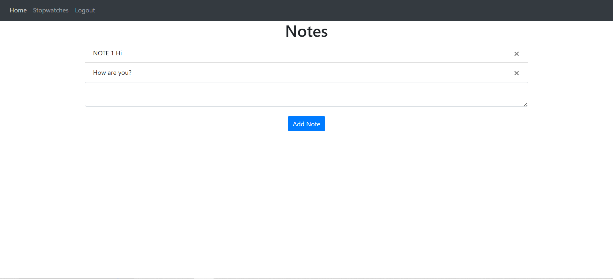
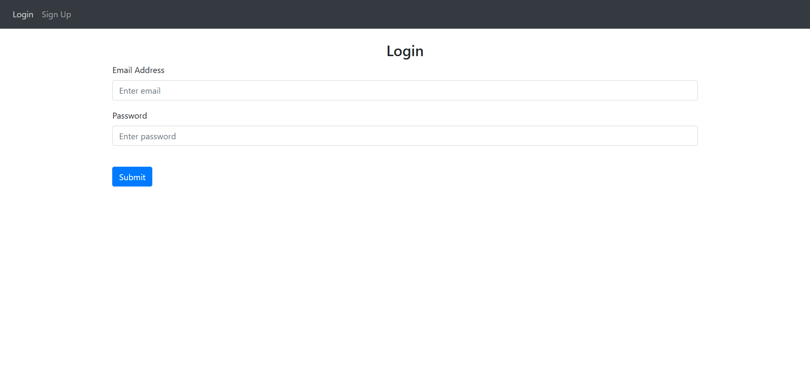
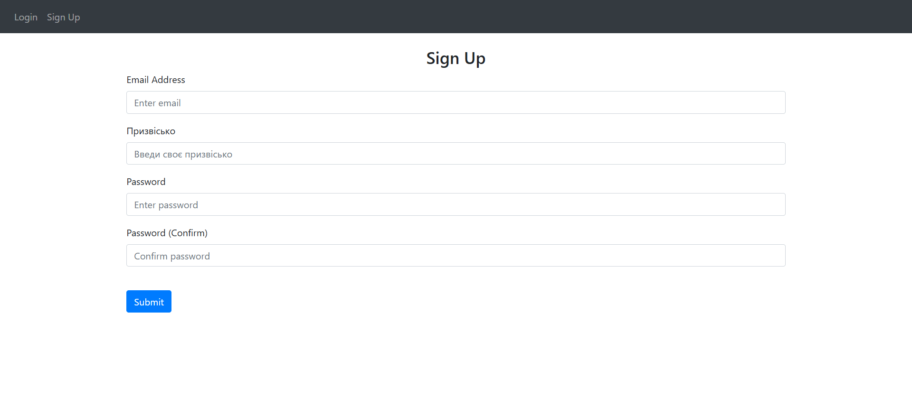

# TimerWebSite ⏱️ 
*A Personal Productivity Platform for Time Management and Focus*

---


  


## 📖 Overview

**TimerWebSite** is a personal productivity platform designed to address the challenges of time-blindness and the difficulty of maintaining focus across multiple activities. By providing a centralized hub for tracking and analyzing daily time allocation, this platform empowers users to optimize their schedules and achieve greater transparency in their time management.

The platform currently features:
- **Robust User Authentication System**: Secure login and registration functionality.
- **Main Dashboard for Personal Note-Taking**: A space to jot down and organize thoughts.
- **Timers Module (In Development)**: A sophisticated time-tracking system based on mutual exclusion, ensuring only one timer is active at a time.

The ultimate goal of TimerWebSite is to provide users with detailed weekly analyses and reports to identify time-wasting activities and improve productivity.

---

## Features

### ✅ Current Features
- **User Authentication**: Built with Flask, ensuring secure access to user accounts.
- **Note-Taking Dashboard**: A simple interface for creating, editing, and deleting personal notes.

### 🚧 In Development
- **Timers Module**:
  - **Custom-Named Trackers**: Users can create timers for specific tasks.
  - **Mutual Exclusion Logic**: Only one timer can be active at any given moment. Starting a new timer automatically pauses the previous one, ensuring data integrity and focused work.

### 🌟 Future Roadmap
- **Weekly Time Analysis**: Generate detailed reports to identify time-wasters and optimize schedules.
- **Expanded Productivity Tools**: Potential features include task prioritization, calendar integration, and collaborative tools.

---

## Technology Stack 🛠️

| **Category**       | **Technology**         |
|---------------------|------------------------|
| **Programming Language** | Python, JavaScript       |
| **Framework**       | Flask                  |
| **Frontend**        | HTML, CSS, JavaScript  |
| **Database**        | SQLite                |

---

## Technical Concepts

### Mutual Exclusion in Timers
The Timers module implements **mutual exclusion** to ensure that only one timer is active at any given moment. This design prevents overlapping time entries, maintaining **data integrity** and promoting focused work.

### Scalability
While the current implementation uses SQLite for simplicity, the platform is designed with scalability in mind. Future iterations may migrate to more robust database solutions like PostgreSQL or MySQL to handle larger datasets and concurrent users.

---


## 📋 Screenshots

### 🖥️ Main Dashboard
The **Notes Dashboard** serves as the primary workspace where users can capture and organize their thoughts. The interface is designed for simplicity and high focus.


*Figure 1: Persistent note-taking interface with a streamlined CRUD flow.*

---

### 🔐 Authentication Flow
Security is a core pillar of TimerWebSite. The platform features a dedicated authentication system to ensure that all user notes and timer data remain private and protected.

| **Secure Login** | **User Registration** |
| :---: | :---: |
|  |  |
| *Figure 2: Encrypted entry portal.* | *Figure 3: Onboarding interface for new users.* |

---

### 📈 Time Analysis (Coming Soon)
*Placeholder for the upcoming Analytics Dashboard, which will visualize weekly time distribution through dynamic charts.*

---

## 📂 Project Directory Structure

```plaintext  
website/
├── main.py                # Entry point for the application
├── README.md              # Project documentation
├── instance/
│   └── database.db        # SQLite database instance
├── website/
│   ├── __init__.py        # Flask app factory
│   ├── auth.py            # User authentication logic
│   ├── database.db        # Development database
│   ├── models.py          # Database models
│   ├── views.py           # Application routes
│   ├── static/
│   │   ├── index.js       # Frontend logic for timers
│   │   └── timer.js       # Timer-specific JavaScript
│   ├── templates/
│   │   ├── base.html      # Base HTML template
│   │   ├── home.html      # Home page
│   │   ├── login.html     # Login page
│   │   ├── sign_up.html   # Sign-up page
│   │   └── stopwatches.html # Timers module UI
│   └── __pycache__/       # Compiled Python files
```

---

## 📬 Contact
Feel free to explore the code! If you have suggestions or questions сheck my profile for contact info.

---
**TimerWebSite**: Empowering users to take control of their time and focus.

